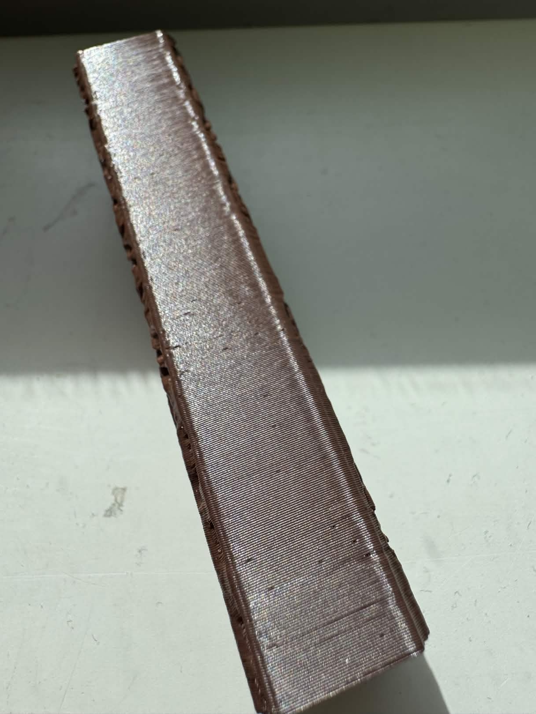

# Pitting, holes, and pockmarks

## Description
The prin has irregular holes in the vertical surfaces (in layer lines) and they're not related to seams.

## Example

Credit: [reappear.](https://discord.com/channels/1086575708903571536/1391156678594134076/1486652588589056136)

## Solutions
### Official SnapMaker Wiki
SnapMaker has a guide in [their official Wiki](https://wiki.snapmaker.com/en/snapmaker_u1/troubleshooting/pitting_and_pockmarks).
##### TL;DR
Reduce or tune retraction. 

### Print profiles
Better PLA print profiles that favor quality over speed can be found in this [Discord thread](https://discord.com/channels/1086575708903571536/1459221045218250925).
