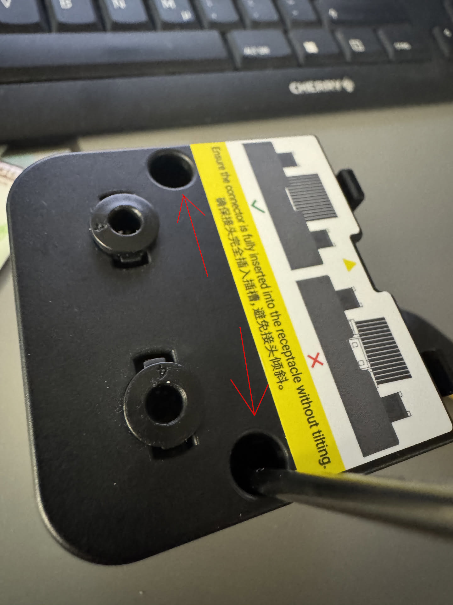
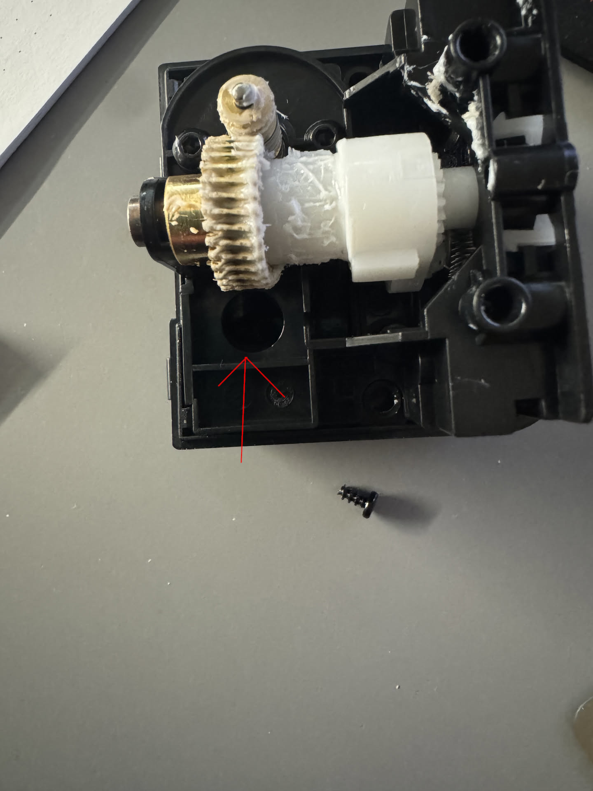
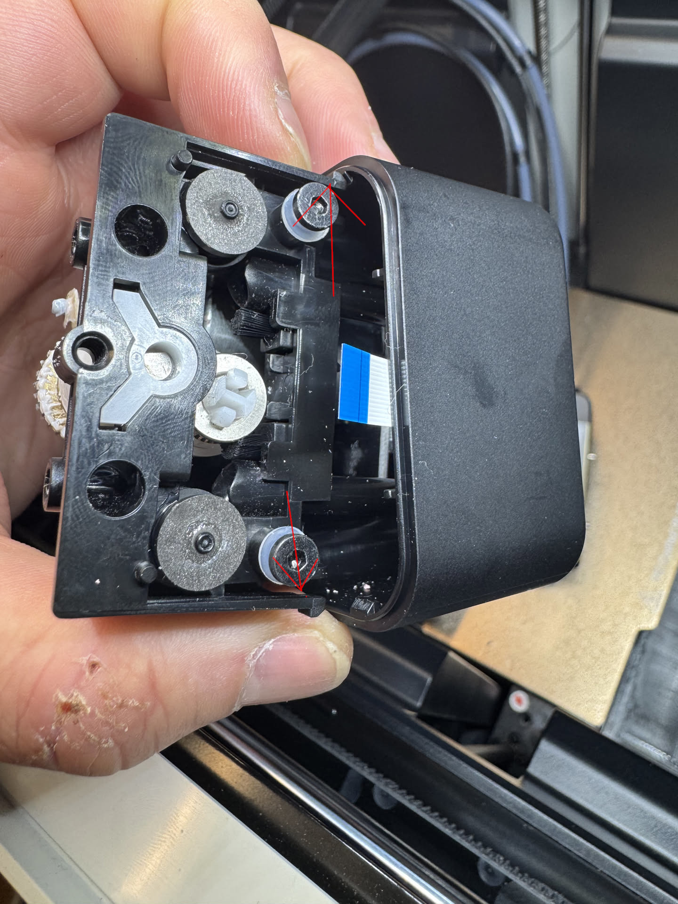
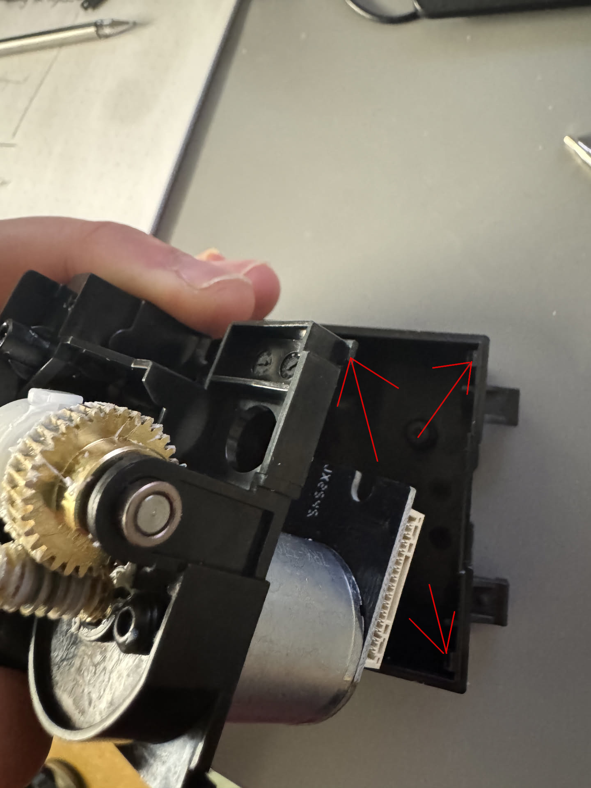
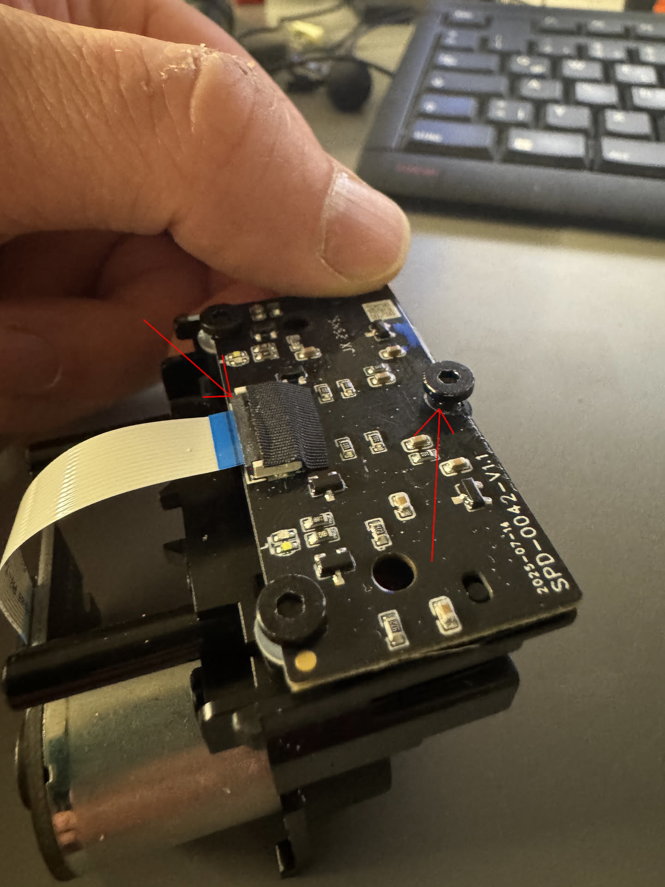
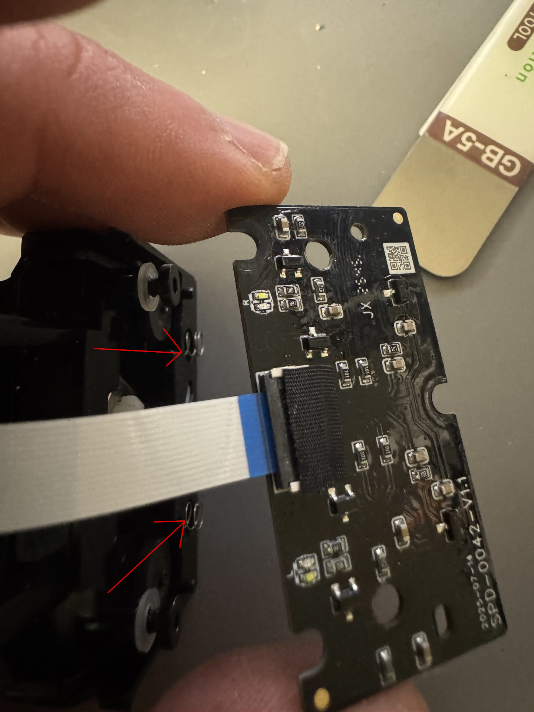
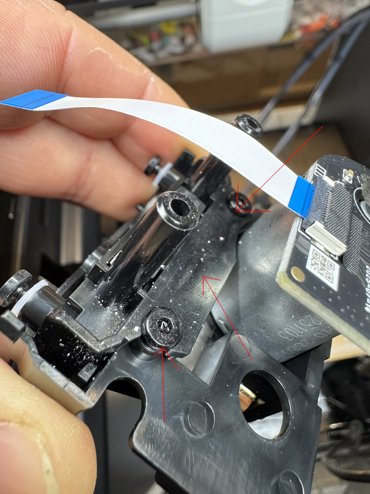

# Dissassembling the feeders and greasing the filament rollers
## Dissassembly
### 1) Unscrew the two screws with a 2mm allen key

### 2) Loosen the bottom screw
You can unscrew it completely or just loosen it a few millimeters. If you unscrew it completely, it might fall into the bottom shell and get stuck on the motor (it's magnetic). It's not an issue, but be aware of it.

### 3) Get the feeder out of the bottom shell
There are tabs that you need to undo. 

Then you can lift the feeder out to the side from under the fixed tabs.

You may need to lift sideways in a few directions to get around the bottom screw from step 2. 
### 4) Disconnect and remove feeeder PCB
Flip the little latch up carefully. Use a flat spudger if you are afraid to do it with your finger nails. The flat cable should then be loose and able to be taken out. 
Then unscrew the single top screw completely and loosen the other two bottom screw. 

**BE CAREFUL WHEN SLIDING OUT THE PCB! The magnets and springs are held in place by the PCB and might jump out and get lost!**

**It is advised to take out the springs and magnets and store them. Store the magnets separate from any other parts, especially the springs!**
### 5) Unscrew the plastic cover

## This is still a WIP, but the above steps should get you there 90%
